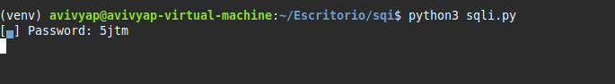
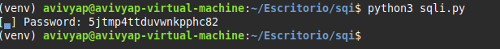
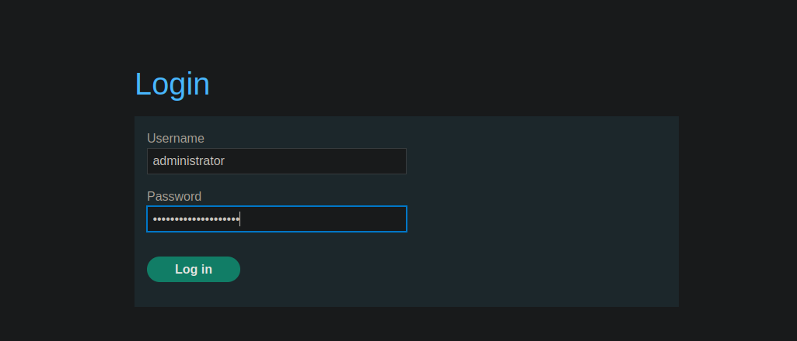
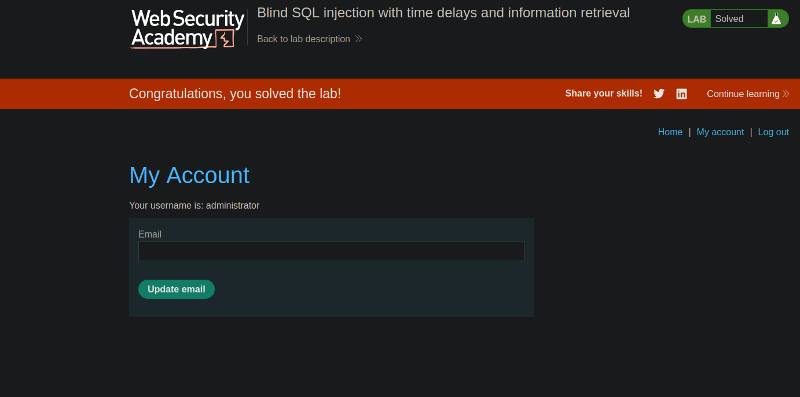

Esta es la información que nos daban antes de realizar el laboratorio.

Así que, una vez que leí la descripción, me puse manos a la obra.

Para empezar, lo que hice fue mirar un poco la página, ver si tenía algún campo vulnerable en el apartado de las categorías, pero vi que no tenía nada (aunque realmente ya se sabía, porque en la descripción del laboratorio nos indicaban que el campo vulnerable era la cookie de sesión).

Así que, una vez probado eso, capturé el tráfico con Burp Suite y empecé a probar cosas.

Estuve probando varias cosas como ' or 1=1, lo cual me devolvía un 200 de código de estado, pero al hacer un ' or 2=1 también me devolvía un 200 de código de estado. Así que empecé a probar sentencias basadas en el tiempo de espera de la página para ver si me las pillaba bien.

Vi que el || pg_sleep(10) sí que me funcionaba, por lo que supe que estábamos ante el gestor de base de datos PostgreSQL, ya que esta función es exclusiva de ese gestor.

Así que, una vez que ya vi que eso me lo interpretaba, empecé a hacer consultas para extraer datos. Pero antes de eso, hice esta prueba:

Ahora que ya había terminado de probar esto, empecé a hacer queries intrusivas para ir sacando cosas de la base de datos, como por ejemplo saber cuál es el nombre de usuario administrador (aunque en la descripción del laboratorio ya nos lo decían).

Realmente la query es muy sencilla. En el caso de que el usuario sea 'administrator', mételo en un sleep de 5 seg; si no lo es, no hagas nada. Con esto realmente ya podíamos deducir bastantes cosas, como por ejemplo la longitud de la contraseña.

La cual era de 20 letras/números.

Ahora, una vez que ya sé de cuántos símbolos (números o letras) se compone la contraseña, quería sacar el primero yo por fuerza bruta manual, ir probando con todo el abecedario y con todos los números hasta que, con el '5', me metió en la página el sleep de 5 seg.

Una vez que ya me sabía el primer carácter de la contraseña, me scripteé un ataque de fuerza bruta con Python para terminar de sacar toda la contraseña.

En resumen, el script hace una petición al servidor con la cookie de sesión y va pasando por cada posición del 1 al 20 (porque anteriormente sacamos que la contraseña tenía 20 caracteres). Y cuando, en la posición x, la letra que toque hace que la página tarde 5 seg en devolver una respuesta, significa que, para esa posición, es esa letra concreta.

Este es el script arrancando y sacando como primer símbolo un '5', que es lo que habíamos sacado antes con la petición que le había hecho en Burp Suite.

Y esta es la contraseña finalmente reportada por nuestro script.

Ahora nos vamos al laboratorio e intentamos iniciar sesión como el usuario 'administrator'.

Y ahí nos sale el mensaje de laboratorio finalizado.

