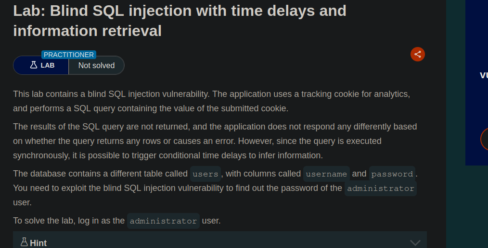
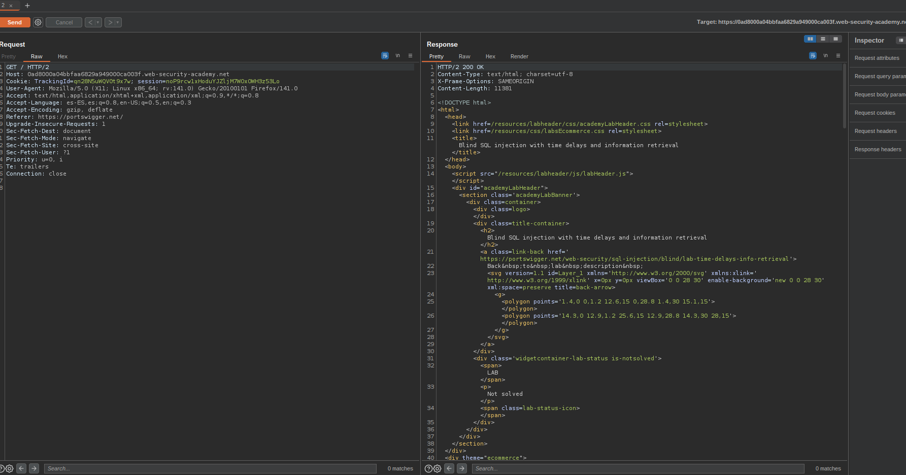
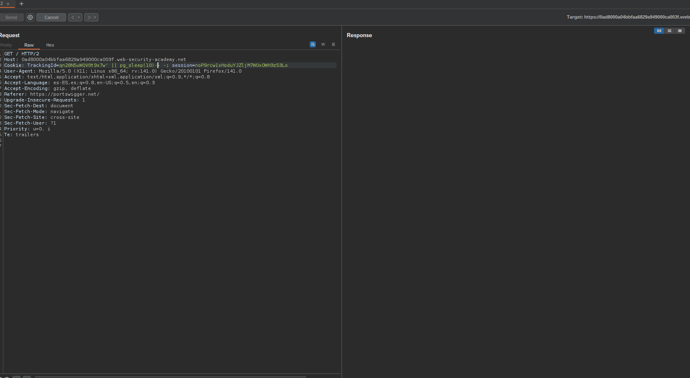
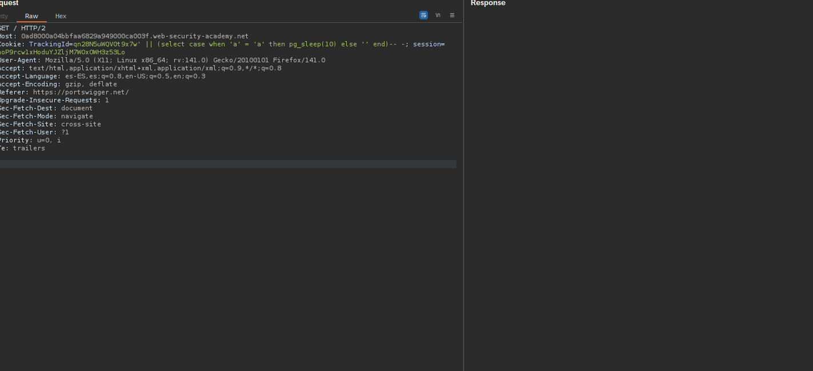
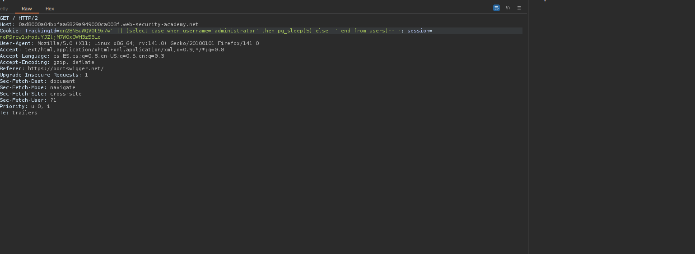
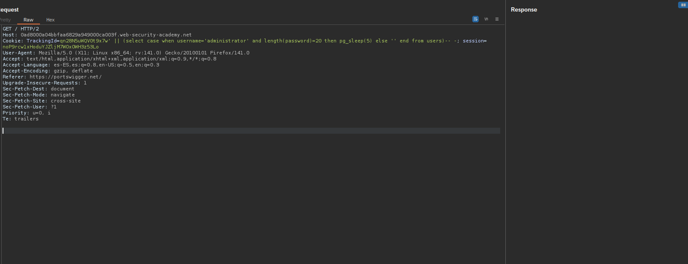
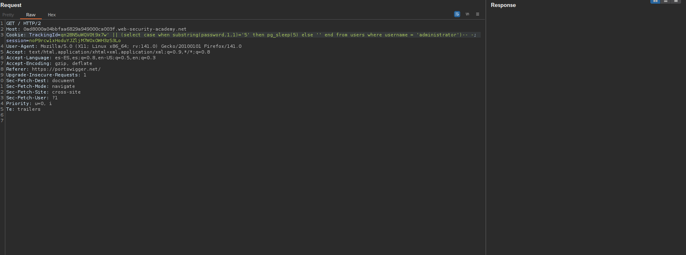
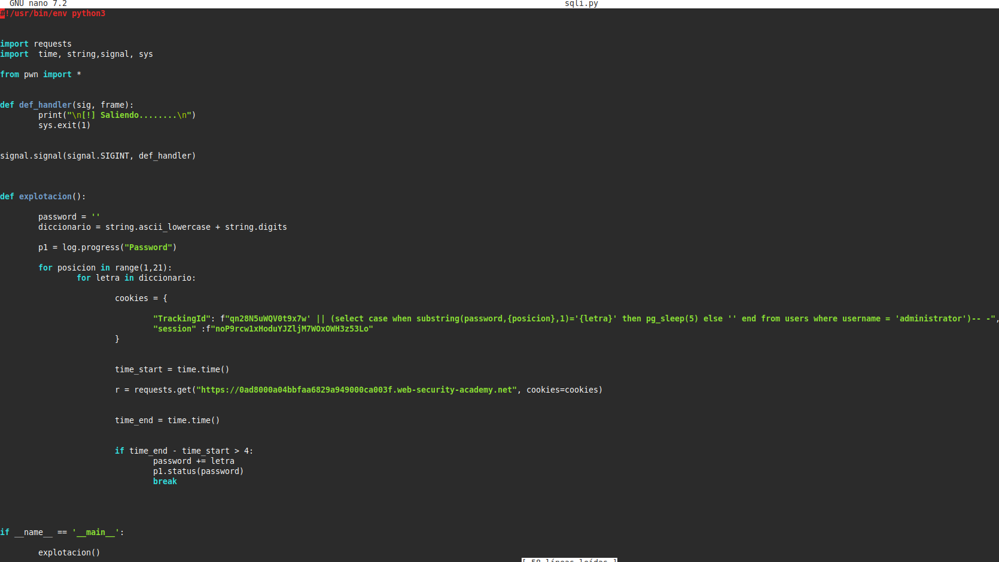

Esta es la informacion que nos daban antes de realizar el laboratorio

Asi que una vez que lei la descripcion me puse manos a la obra

Para empezar lo que hice fue mirar un poco la pagina, ver si tenia algun campo vulnerable en el apartado de las categorias, pero vi que no tenia nada (aunque realmente ya se sabia por que en la descripcion del laboratorio nos indicaban que el campo vulnerable era la cookie de sesion)

Asi que una vez probado eso, capture el trafico con burpsuite y empece a probar cosas

Estuve probando varias cosas como ' or 1=1 lo cual me devolvia un 200 de codigo de estado pero al hacer un ' or 2=1 tambien me devolvia un 200 de codigo de estado, asi que empece a probar sentencias basandose en el tiempo de espera de la pagina para ver si me las pillaba bien

Vi que el || pg_sleep(10) si que me funcionaba por lo que supe que estabamos ante el gestor de base de datos ProstgreSQL ya que esta funcion es exclusiva de ese gestor

Asi que una vez que ya vi que eso me lo interpretaba empece a hacer consultas para extraer datos, pero antes de eso hice esta prueba

Ahora que ya habia terminado de probar esto empece a hacer querys intrusivas para ir sacando cosas de la base de datos, como por ejemplo saber cual es el nombre de usuario administrador (aunque en la descripcion del laboratorio ya nos lo decian)

Realmente la query es muy sencilla, en el caso de que el usuario sea 'administrator' meteme un sleep de 5 seg sino no lo es no hagas nada, con esto realmente ya podiamos deducir bastantes cosas como por ejemplo la longitud de la contraseña

La cual era de 20 letras/numeros

Ahora una vez que ya se de cuantos simbolos(numeros o letras) se compone la contraseña, queria sacar el primero yo por fuerza bruta manual, ir probando con todo el abecedario y con todos los numeros hasta que con el '5' me metio en la pagina el sleep de 5 seg

Una vez que ya me sabia el primer carácter de la contraseña, me scripteé un ataque de fuerza bruta con python para terminar de sacar toda la contraseña

